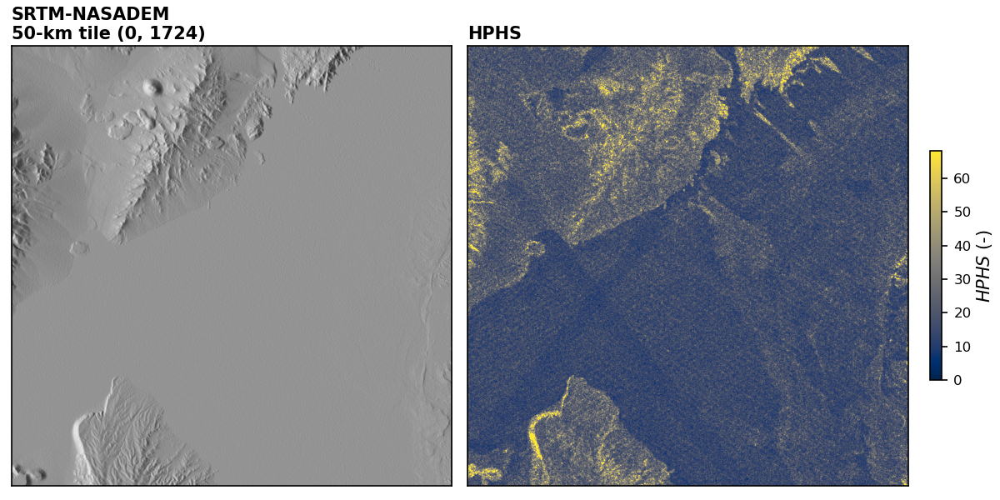

# DEM-Consistency-Metrics

This is a collection of tools to evaluate inter-pixel consistency metrics on gridded digital elevation models (DEMs) as outlined in:

  > Purinton, B. and Bookhagen, B, Beyond vertical point accuracy: Assessing inter-pixel consistency in 30 m global DEMs for the arid Central Andes, 2021, Frontiers in Earth Science, _https://www.frontiersin.org/articles/10.3389/feart.2021.758606_.




# Code Description

All utility functions are found in `DemErrorFunctions.py`.

A script to calculate and plot three error metrics described in the paper is `error_metrics.py`. These metrics are:

* Gaussian smoothing and differencing, _dR_ (m)
* Plane fit residuals, _RMSE_ (m)
* High-pass hillshade filtering, _HPHS_ (-)

A script to tile and run the Fourier frequency analysis on the open access SRTM-NASADEM is `fourier_analysis.py`.

# SRTM Tile Preparation

The SRTM-NASADEM is provided in the `data` directory. It is a 1 by 1 degree tile at native 1 arcsec resolution in WGS84/EGM96 horizontal/vertical datum. The original data downloaded from https://lpdaac.usgs.gov/products/nasadem_hgtv001 was renamed and converted to GeoTiff format with this gdal command:

```
gdal_translate -of "GTiff" s25w068.hgt nasadem_s25w068.tif
```

In the `data` folder there is also a cubic spline resampled version (UTM Zone 19S, 30 m pixels) that was generated using the gdal command:

```
gdalwarp -tr 30 30 -tap -r cubicspline -t_srs EPSG:32719 nasadem_s25w068.tif nasadem_s25w068_utm19s_30m_cubicspline.tif
```
